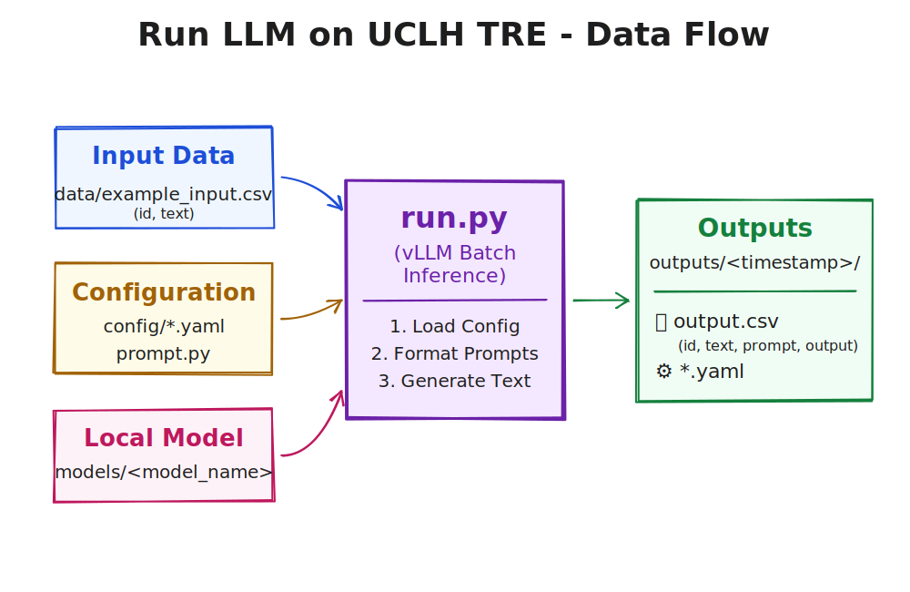

# Run LLM on UCLH TRE

This repo is our current best practice for running a local large language model (LLM) on a batch of clinical text in the UCLH TRE using Hugging Face transformers.




**Projects Using This Code**

*(List of projects will be added here...)*

If you use this repository for your research, please let us know so we can add your project to this list!

---

## Table of Contents

- [Repository Layout](#repository-layout)
- [Getting Started](#getting-started)
- [Workflow Steps](#workflow-steps)
  - [1. Install dependencies](#1-install-dependencies)
  - [2. Prepare your input CSV](#2-prepare-your-input-csv)
  - [3. Iterate on your prompt](#3-iterate-on-your-prompt)
  - [4. Choose a model](#4-choose-a-model)
  - [5. Configure the run](#5-configure-the-run)
  - [6. Run the pipeline](#6-run-the-pipeline)
- [Outputs](#outputs)
- [Troubleshooting](#troubleshooting)
- [Contributing](#contributing)
- [Citation and Acknowledgements](#citation-and-acknowledgements)
- [Contact](#contact)

---

## Repository Layout

```text
run-llm-on-uclh-tre/
├── config/               ← Environment-specific configurations
│   ├── cpu.yaml          ← Use this for local CPU testing
│   ├── t4.yaml           ← Use this for T4 GPUs in the TRE
│   └── a100.yaml         ← Use this for A100 GPUs in the TRE
├── prompt.py             ← Edit this: define your system and user
├── run.py                ← Main script for inference
├── requirements.in       ← Top-level dependencies
├── requirements.txt      ← Compiled dependencies
├── data/
│   └── example_input.csv ← Example input file
└── outputs/              ← Created automatically when you run the script
```

The config directory has the best "current" models that we have got working in each environment. This changes rapidly, so if you get a better model working please update the config (see [contributing](#contributing))!!

---

## Getting Started

This repository is a starting point. We recommend **forking** it for your own research projects to safely modify prompts and configurations while maintaining version control. If you fix a bug, improve documentation, or add a generally useful feature to `run.py`, please **contribute** it back via a Pull Request.

It is highly recommended to run the pipeline on your local machine first to test the prompt and configuration before moving to the TRE. This saves TRE costs and local development is much faster and easier!

**If you are new to this:**
- Highly recommend reading the following docs
  -  SAFEHR TRE docs: [README.md](https://github.com/SAFEHR-data/safehr-data-service-catalogue/blob/main/User-Guides/TRE/README.md) and [llm-vms.md](https://github.com/SAFEHR-data/safehr-data-service-catalogue/blob/main/User-Guides/TRE/llm-vms.md)
  - Hugging Face: [Pipelines](https://huggingface.co/docs/transformers/en/main_classes/pipelines) and [Text Generation](https://huggingface.co/docs/transformers/en/main_classes/pipelines#transformers.TextGenerationPipeline) to understand the configuration options.
- Clone the repository to your local machine for prompt development.
- Follow the steps below and use `./config/cpu.yaml` to run the pipeline on your local machine.
  - Use dummy data to test the pipeline (LLMs are great at creating this, see `data/example_input.csv` for an example).
  - Using `--dry-run` flag will let you refine the prompt by printing the first example.
- Move the setup to the TRE and run the pipeline on your real data, GPUs and better models!
  - Robust way to do this is to zip the repo and upload it to the TRE.
  - Quick way to do this is to copy and paste files across...

## Workflow Steps

### 1. Install dependencies

Open a terminal in the repository folder and run:

```bash
python -m venv .venv
source .venv/bin/activate       # On Windows: .venv\Scripts\activate
pip install -r requirements.txt
```

### 2. Prepare your input CSV

By default your input file must contain at least two columns with lowercase headers: `id` and `text`. See `data/example_input.csv` for an example.

### 3. Iterate on your prompt

Edit `prompt.py` to define the `SYSTEM_PROMPT` and the `build_messages` function. Use `{text}` to insert content from the CSV row.

Use the `--dry-run` flag to test the pipeline on your local machine.

### 4. Choose a model

### Locally

Download a small model to test with (we have had success with `Qwen/Qwen3-0.6B`):

```bash
pip install huggingface-cli
huggingface-cli download Qwen/Qwen3-0.6B --local-dir ./models/Qwen3-0.6B
```

### In the TRE

Check the airlock to see if the model is already available.

If not, download it from Hugging Face on a machine with internet access, zip the folder, and upload it to the airlock:

```bash
huggingface-cli download <HUGGING_FACE_MODEL> --local-dir ./models/<MODEL_NAME>
zip -r ./models/<MODEL_NAME>.zip ./models/<MODEL_NAME>
```
Follow the [SAFEHR docs](https://github.com/SAFEHR-data/safehr-data-service-catalogue/blob/main/User-Guides/TRE/import-data-to-the-TRE-workspace.md#import-data-to-the-tre-workspace) to import the zipped data to your virtual machine in the TRE.
- TIP: If using UCL Wi-Fi, Eduroam blocks uploads to airlock (we think due to firewalls) so use UCL Guest network instead.

### 5. Configure the run

Select and update the appropriate configuration file from the `config/` directory. You may want to consider parameters such as:
- Generation parameters such as temperature (the model docs usually recommend values)
- Max input and output lengths
- Diving into the full [generation config](https://huggingface.co/docs/transformers/en/main_classes/text_generation#transformers.GenerationConfig) for all the options

### 6. Run the pipeline

**Local prompt preview (no GPU or model required):**
```bash
python run.py --input data/example_input.csv --config config/cpu.yaml --dry-run
```

**Full job (in the TRE with GPU):**
```bash
python run.py --input data/example_input.csv --config config/a100.yaml
```

---

## Outputs

Results are saved to `outputs/<timestamp>/`, containing:
- `<input_filename>.csv` — original data plus `output` column (can be exported and viewed in Excel).
- `<input_filename>.json` — results in JSON format (nice to look at as code in your IDE).
- `<config_name>.yaml` — copy of the configuration used (preserves the original filename).
- `prompt.py` — copy of the prompt definition used.
- `cli_args.json` — record of the command-line arguments.
- `run.log` — log of the run.

The idea is that you can reproduce the exact same results at a later date by using the same config and prompt files.

---

## Troubleshooting

- **Out of memory:** Reduce `batch_size` in your config file (e.g., `config/t4.yaml`) or use a smaller/quantized model.
- **Model directory not found:** Check the `model` path in your config file.
- **Input CSV missing columns:** Ensure column names are exactly `id` and `text` (lowercase).

---

## Contributing

Contributions are welcome! If you are modifying the code or documentation, please follow these steps:

1. **Pre-commit hooks:** We use `pre-commit` to maintain code formatting.
   ```bash
   pip install pre-commit
   pre-commit install
   ```
2. **Updating requirements:** We use `pip-tools` to manage dependencies. If you add or alter top-level dependencies, update `requirements.in` and run:
   ```bash
   pip install pip-tools
   pip-compile requirements.in
   ```
3. **Spelling:** Please use British English spelling for all documentation and comments (e.g., "programme", "summarise", "colour").

Open a PR (including adding yourself to the citation if you like) and we will merge it in!

### Future Work

- Are there better ways to run LLMs in the TRE? (e.g. vLLM, ollama etc...)
- Run a quantized model
- Add explanation on expected max context windows
- Add support for tools, structured outputs etc

---

## Citation and Acknowledgements

If you use this code in your work, please acknowledge it. We recommend citing it as follows:

```bibtex
@misc{run-llm-on-uclh-tre,
  author = {Simon Ellershaw},
  title = {Run LLM on UCLH TRE},
  year = {2026},
  publisher = {GitHub},
  journal = {GitHub repository},
  howpublished = {\url{https://github.com/llms-at-uclh/run-llm-on-uclh-tre}}
}
```

---

## Contact

For questions, support, or to notify us that you are using this code, please contact:

- <simon.ellershaw.20@ucl.ac.uk>
- Or simply open an Issue or Pull Request in this repository!

If anything isn't clear, please don't hesitate to ask so we can improve the documentation!
